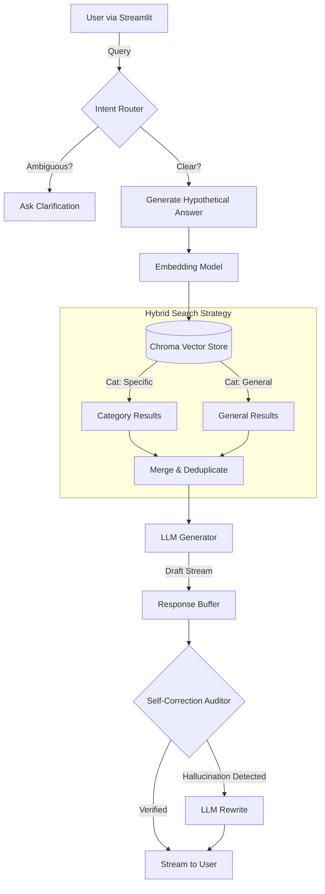

# 📘 Technical Documentation: Agentic RAG for State Property (Kazakhstan)

## 1. Executive Summary
This project implements an **Agentic Retrieval-Augmented Generation (RAG)** system designed to act as an automated legal consultant for the "Committee of State Property and Privatization".

Unlike standard "semantic search" bots, this system employs **Agentic Patterns** (Router, HyDE, Self-Correction) to mimic the reasoning process of a human lawyer:
1.  **Clarify:** "Do you mean transfer of *communal* or *republican* property?"
2.  **Retrieve:** Search for specific laws *and* related general rules.
3.  **Draft:** Compose an answer based *only* on the text.
4.  **Verify:** Critique the answer for hallucinations before showing it to the user.

---

## 2. System Architecture

The system is built on a modular Service-Oriented Architecture (SOA), decoupling the frontend (Streamlit) from the core logic (Agent) and data layer (ChromaDB).

### 2.1 High-Level Diagram



---

## 3. Core Components Breakdown

### 3.1 `src/agent.py` (The Brain)
The `Agent` class orchestrates the entire pipeline.
*   **`__init__`**: Initializes DB connection and hardware-accelerated embedding models.
*   **`check_need_clarification`**: Uses an LLM call to classify if the user's query is complete. If not, it returns a question back to the user.
*   **`generate_hyde_doc`**: Hallucinates a fake legal document to improve semantic matching for short queries like "selling car".
*   **`retrieve`**: Performs a dual-search:
    *   Query filtered by `category` (e.g., "Privatization").
    *   Query filtered by `category="General"` (to catch fundamental laws).
*   **`self_correct`**: The "Critic" loop. It takes the draft answer and the raw source text, then asks a fresh LLM instance to "Audit" the answer for unsupported claims.

### 3.2 `src/ingestion.py` (The Knowledge Builder)
Data quality is paramount. This module doesn't just chunk text; it understands legal structure.
*   **Hierarchical Parsing**:
    *   It identifies **headings** (Chapter 1, Article 5).
    *   It recursively attaches this hierarchy to every child chunk.
*   **Chunking Strategy**:
    *   Standard size: 1000 characters.
    *   Overlap: 200 characters.
    *   **Metadata Injection**: `"full_context": "Law on State Property > Chapter 3 > Article 15"` is embedded along with the text.

### 3.3 `src/utils.py` (Hardware Acceleration)
*   **`get_compute_device()`**: Automatically selects the fastest available tensor core:
    *   **CUDA**: For NVIDIA GPUs (Linux/Windows).
    *   **MPS**: For Apple Silicon (M1/M2/M3).
    *   **CPU**: Fallback.

---

## 4. Data Flow Scenarios

### Scenario A: The Ambiguous Query
*   **User:** "how to sell?"
*   **Router:** Detected ambiguity.
*   **Agent:** Returns "Clarification needed: Do you want to sell *state* property or *transfer* it?"
*   **UI:** Displays the question. Search is aborted.

### Scenario B: The Complex Legal Question
*   **User:** "Can I transfer a school to private ownership?"
*   **HyDE:** Generates a fake doc about "prohibition of privatizing social objects".
*   **Retrieval:** Finds "Article 10: Objects not subject to privatization".
*   **Draft:** "No, you cannot."
*   **Critic:** Verifies against Article 10. "Confirmed."
*   **Output:** "According to Article 10, social objects are not subject to privatization."

---

## 5. Technology Stack

| Component | Technology | Reason |
| :--- | :--- | :--- |
| **LLM** | **Grok (grok-beta)** | Strong reasoning, large context window (128k). |
| **Vector DB** | **ChromaDB** | Local, fast, no external server required. |
| **Embeddings** | **OpenAI text-embedding-3-small** | High performance, low cost. |
| **Frontend** | **Streamlit** | Rapid UI development with streaming support. |
| **Parsing** | **python-docx / pymupdf** | Robust text extraction. |

---

## 6. Directory Structure
```text
rag_latest/
├── app.py                 # Main Entry Point (Streamlit)
├── src/
│   ├── agent.py           # Core RAG Logic
│   ├── ingestion.py       # Data Loading & Indexing
│   ├── database.py        # ChromaDB Singleton
│   ├── utils.py           # Hardware Utils
│   └── config.py          # API Keys & Constants
├── data_npa/              # Knowledge Base (source files)
└── requirements.txt       # Dependencies
```
