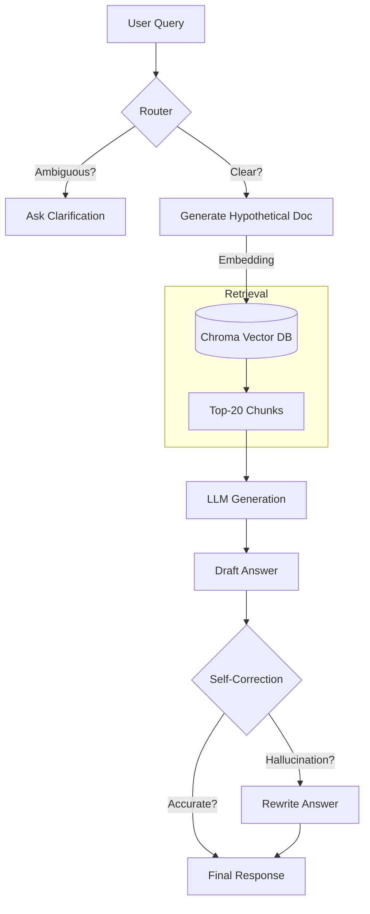

# 📘 Documentation: Agentic RAG for State Property Law (Kazakhstan)

## 1. Project Overview
This project is an **Agentic RAG (Retrieval-Augmented Generation)** system designed to assist users with legal questions regarding **State Property Management in Kazakhstan** (Privatization, Rent, Transfer, Write-off, etc.).

It goes beyond simple key-word search by using **Active Agentic Patterns** to understand intent, clarify ambiguities, expand queries, and self-correct its own answers.

---

## 2. Key Features & Techniques

### 🧠 1. Agentic Router (Intent Classification & Clarification)
Before searching, the system analyzes the user's query to determine two things:
1.  **Intent/Category**: Does this relate to *Privatization*, *Rent*, *Transfer*, etc.? This allows us to filter the vector database for higher precision.
2.  **Ambiguity Check**: If the user asks "How to sell it?", the Router checks conversation history. If context is missing, it **asks a clarifying question** instead of hallucinating.

**Code:** `src/agent.py` -> `check_need_clarification`

### 🔮 2. HyDE (Hypothetical Document Embeddings)
*Technique for solving "Short/Vague Query" mapping.*

**Problem:** Users search for "selling car", but the law says "alienation of vehicle assets via auction". Semantic distance is far.
**Solution (HyDE):**
1.  The Agent hallucinates a **Hypothetical Ideal Answer** using the user's query.
2.  *Example Hallucination:* "To sell a state vehicle, you must conduct an e-auction via Gossreestr web portal..."
3.  We embed this *fake* answer and search for *real* documents that look like it.
4.  **Result:** Much higher retrieval accuracy for legal terms.

**Code:** `src/agent.py` -> `generate_hyde_doc`

### 🛡️ 3. Self-Correction (The "Critic" Loop)
*Technique for ensuring Legal Accuracy.*

**Problem:** LLMs can "hallucinate" procedures (e.g., inventing a "10-day waiting period" that doesn't exist).
**Solution:**
1.  **Generate**: The Agent reads retrieved docs and generates Answer V1.
2.  **Critique**: A separate "Auditor" prompt reads Answer V1 and the *Source Context*.
3.  **Verify**: It checks: *Does every claim in the answer have backing in the text?*
4.  **Rewrite**: If errors are found, it rewrites the answer using *only* the facts.

**Code:** `src/agent.py` -> `self_correct`

### 📚 4. Hierarchical Ingestion
We don't just split text by 500 characters. We parse **Legal Structure**:
*   **Sections** (Главы)
*   **Articles** (Статьи)
*   **Context Preservation**: Every chunk keeps its parent headers as metadata.
    *   *Chunk Text:* "The limit is 5 years."
    *   *Metadata Context:* "Law on Rent > Chapter 3 > Article 15 > Limitations"

**Code:** `src/ingestion.py`

---

## 3. Architecture



---

## 4. Installation & Setup

### Prerequisites
*   Python 3.10+
*   OpenAI API Key (or Grok API Key)

### Step 1: Clone & Install (Lightweight)
```bash
git clone https://github.com/allebee/rag_latest.git
cd rag_latest
python -m venv venv
source venv/bin/activate
pip install -r requirements.txt
```

### Step 2: Configure Keys
Create a `.env` file:
```bash
GROK_API_KEY=xai-your-key-here
# OPENAI_API_KEY=... (Optional, if using OpenAI for embeddings)
```

### Step 3: Build Knowledge Base
Run the ingestion script to parse your `data_npa/` and `data_instructions/` folders:
```bash
python -m src.ingestion
```
*Creates `chroma_db/` folder locally.*

### Step 4: Run the App
```bash
./run_app.sh
```
*Access at http://localhost:8501*

---

## 5. Usage Examples

### Example 1: HyDE in Action
**Query:** "как отдать школу?" (How to give away a school?)
*   **Without HyDE:** Might match irrelevant "school" keywords.
*   **With HyDE:**
    *   *Hypothetical:* "Передача объектов образования (школ) из коммунальной собственности в республиканскую регулируется правилами..."
    *   *Retrieval:* Finds exact laws on "Transfer of social assets".

### Example 2: Self-Correction
**Scenario:** Agent mistakenly adds "You need to wait 3 days."
**Critic Log:**
> *Checking Answer...*
> *Claim "wait 3 days" NOT found in Article 45.*
> *Action: REWRITE without time limit claim.*
**Final Output:** Correct procedure only.
